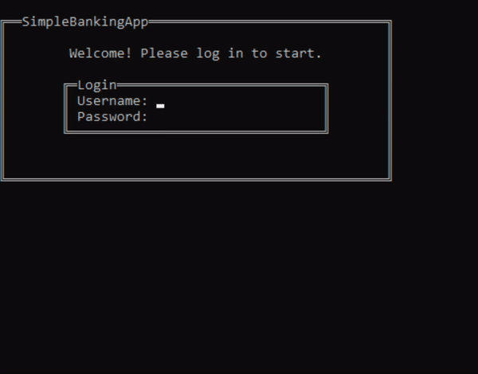

# SimpleBankingApp

This console application is a bank management system developed in C# using .NET Framework. It facilitates basic banking operations such as account creation, deposits, withdrawals, and more. It is part of an .NET programming assignment for the University of Technology Sydney (UTS).

🔗[Demo](https://youtu.be/eblMLFwIp6w)

## Requirements
- Operating System: Windows
- .NET Framework Version: 4.7.2 or higher

## Features
- Secure login system
- Account management (create, search, deposit, withdraw, delete)
- Email notification for new accounts
- Create account statements and send via email
- Interactive console-based user interface
